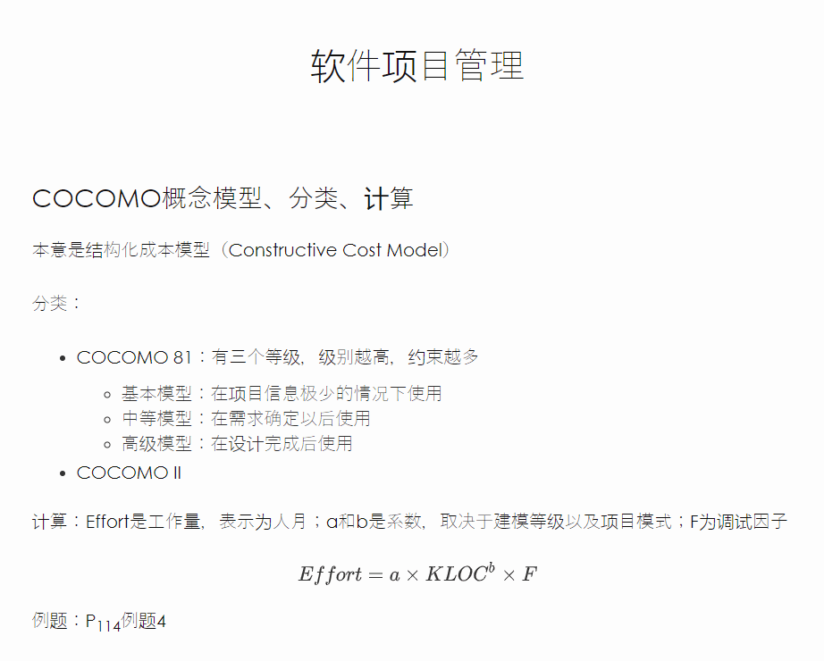
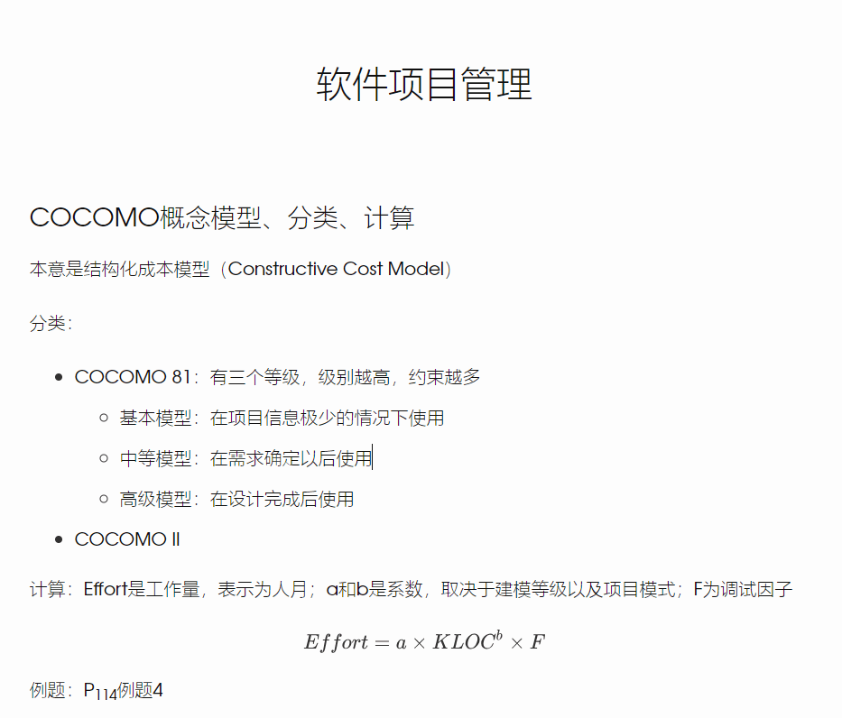

# Gothic_Han
Gothic_Han is a typora theme forked from typora default theme [gothic](<http://theme.typora.io/theme/Gothic/>) 
Gothic_han is a theme designed for Chinese articles,it solves the problem that the font-weight of typora's Gothic theme shows different in Chinese. 
Gothic_Han是基于Typora默认主题 [gothic](<http://theme.typora.io/theme/Gothic/>)进行修改的，解决了中文状态下文字显示发虚以及font-weight不一致的问题。

---

